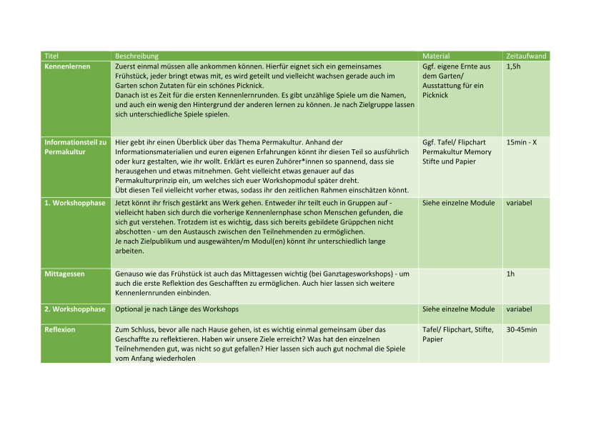

# Gärtnern nach Permakulturprinzipien

## Was sind eigentlich Open Educational Resources?

Der Begriff Open Educational Resources (OER), wurde zuerst im Juli 2002 in dem Abschlussbericht des *Forum on the Impact of Open Courseware for Higher Education in Developing Countries* der *UNESCO *verwendet. Dort wird er als 'universal educational resource  available for the whole of humanity' (deutsch: "universelle Ressource für die Bildung, die der gesamten Menschheit zur Verfügung steht") definiert. OERs sind gemeinfrei oder wurden unter einer offenen Lizenz veröffentlicht, die kostenlosen Zugang, Anpassung, Veränderung und die Weiterverbreitung erlaubt. OER können sehr unterschiedliche Formen annehmen. Diese OER ermöglicht es, Workshops zum Thema Permakultur anzubieten, ohne tiefere Kenntnisse über das Konzept der Permakultur zu haben.

## Wie kann diese OER verwendet werden

Das Ziel dieser OER ist für die Durchführung von Permakultur-Workshops in Gemeinschaftsgärten gedacht. Da wir uns hier nicht auf ein konkretes Projekt festlegen wollen, enthält das Konzept verschiedene Module, die sich in Aufwand, Kosten, Voraussetzungen und Jahreszeit unterscheiden. Aus diesen Modulen kann dann ein Workshop zusammengestellt werden. Eine weitere Möglichkeit besteht darin, mehrere Workshops parallel durchzuführen. In diesem Fall kann auch das Rahmenprogramm gemeinsam durchgeführt werden und die Gruppe trennt sich nur für die Projekte.

Zuerst bieten wir aber spannendes **eine kurze Einführung** mit Hintergrundwissen zu Permakultur an, damit dieser Workshop auch von Personen durchgeführt werden kann, die gerade erst in das Thema einsteigen. Dann stellen wir euch einen typischen **Tagesablauf** vor, der natürlich den Gegebenheiten angepasst werden kann. Er enthält etwas Rahmenprogramm zum eigentlichen Projekt, das aus den Modulen verwendet werden kann. Außerdem geben wir noch einige **didaktische Hinweise **zur Durchführung.

## Kurze Einführung zur Permakultur                   

Zunächst ist es für euch wichtig zu wissen, dass man über Permakultur auch einwöchige Schulungen geben kann. Deshalb – dieser Workshop hat den Sinn, dass ihr euch anfangt mit der Thematik auseinanderzusetzen und die Prinzipien der Permakultur umsetzen lernt. Wie weit ihr euch selbst in das Thema einarbeitet, hängt von euch selbst ab. Sagt auch euren Teilnehmenden, ihr seid keine Profis auf dem Gebiet, wer sich gerne weiterbilden möchte, dem*der könnt ihr die unten genannte Literatur ans Herz legen – oder er*sie möchte doch an einer längeren Schulung teilnehmen.

Zunächst ein Ausschnitt (leicht verändert) aus unserem Projektbericht in dessen Rahmen der Workshop entstanden ist:

Die Permakultur ist ein Gegenentwurf zur modernen Landwirtschaft, welcher eine ganzheitliche Alternative zur Ausbeutung von Ressourcen durch intensiven Anbau, aggressive Schädlingsbekämpfung und Überdüngung bietet. Sie versteht sich als nachhaltige Anbauweise um die Auswirkungen auf die Umwelt zu minimieren und langfristig Fruchtbarkeit und Vielfalt zu erhöhen Das Wort stammt aus dem Englischen von ‚permanent agriculture‘. 

Das Konzept der Permakultur entstand aus der Besorgnis über die mit der Industrialisierung der Landwirtschaft einhergehende Umweltzerstörung. Im Zuge der Industrialisierung wurden moderne Technologien eingeführt, die dazu führten, dass sich die traditionelle, natürliche Bewirtschaftung in eine intensive Landnutzung verwandelte. Um 1960 entwickelte Bill Morrison Ansätze für eine nachhaltigere Anbauweise und legte damit zusammen mit seinem Schüler David Holmgren die Grundsätze der Permakultur fest. Sie sollte Brücken zwischen Natur und Zivilisation sowie zwischen Tradition und Moderne bauen.

Die Idee der Permakultur ist es, natürliche Prozesse nachzuahmen und durch ökologische Vielfalt die Resilienz gegen Umwelteinflüsse zu steigern. Sie bietet eine Möglichkeit, die Folgen der modernen Landwirtschaft zu mildern und den Umweltschutz in den Vordergrund zu stellen. 

Die Philosophie der Permakultur zieht sich durch alle Lebensbereiche. Damit endet sie nicht im Garten, sondern schließt alle Bereiche ein: von Landschaft oder Umfeld über die Wasser-, Energie- und Abfallwirtschaft, bis hin zum eigenen Haus. Hier spricht man von den 5 Säulen der Permakultur: Ernährung, Energie, Architektur, Technologie und Bildung, sowie Kooperation. Im eigenen Zuhause lässt sich Permakultur sowohl auf dem Balkon als auch in größerem Stil realisieren. Grundlegend wird ein Garten, welcher nach den Permakultur Prinzipien bewirtschaftet wird, in fünf Zonen aufgeteilt, welche sich von der intensivsten Pflege in Zone 1 bis zu der unbewirtschafteten Zone 5 erstrecken:

Im Mittelpunkt steht der Mensch, der Wohnbereich, also das eigene Haus oder im Garten der primäre Aufenthaltsraum. Dieser Bereich wird als Zone 0 bezeichnet. Zone 1 beinhaltet alles, was intensive Pflege braucht oder viel genutzt wird, also Küchenkräuter, zum Beispiel in der Kräuterschnecke. In Zone 2 befinden sich dann z.B. Gemüsebeete oder ein Gewächshaus. Diese Zone benötigt auch intensive Pflege, wird aber nicht so häufig genutzt. Dinge die nur gelegentliche Pflege benötigen, also beispielsweise Obstbäume stehen in Zone 3. Wenn ihr Tiere habt, so wohnen die auch in Zone 3, obwohl sich hier darüber streiten lässt, ob diese jetzt unter ‚gelegentliche Pflege‘ fallen. Gehört eurem Garten Weideland oder ein Stück bewirtschafteter Wald, so befindet sich dieses in Zone 4. Zuletzt gibt es Zone 5, in dieser ist Raum für Wildnis, sie bietet einen Ruheraum für Mensch und Natur und wird nicht bewirtschaftet. Das kann außerhalb eures Gartens sein, aber auch ein ausgewiesener Teil, welchen ihr aktiv sich selbst überlasst.

David Holmgren, einer der Begründer der Permakultur, hat zwölf Handlungsleitsätze, die Prinzipien der Permakultur entwickelt. Anhand derer haben wir auch unseren Workshop aufgebaut. Die Module sind nach den Prinzipien geordnet, d.h. indem ihr den Workshop durchführt, könnt ihr auf das jeweilige Prinzip näher eingehen. Im Anschluss gibt es auch noch ein Permakultur Memory, damit könnt ihr nach dem Theorieteil schauen wieviel sich eure Teilnehmenden gemerkt haben.

   1. **Beobachte und handle:** Durch die Auseinandersetzung mit der Natur lassen sich auf die einzelne Situation angepasste Lösungen finden. Hier geht es darum, von der Natur zu lernen. Die Natur hat ihre Prozesse bereits optimiert, warum sollten wir gegen sie arbeiten? Dieses Prinzip zieht sich auch durch die ganze Philosophie der Permakultur.
   1. **Sammle und speichere Energie:** Bezieht sich auf das Speichern von Energie, wenn diese im Überfluss vorhanden ist. So lässt sich davon zehren, wenn keine mehr zur Verfügung steht. Das bedeutet, dass Ressourcen optimal und effizient genutzt werden. Hier geht es darum, langfristige Systeme zu bauen, die sich selbst erhalten. Z.B. Mehrjährige Pflanzen, Wasserspeicher, eigenes Saatgut. 
   1. **Einen Ertrag erzielen:** Es ist wichtig einen Ertrag zu erzielen. Wie dieser aussieht, ist nicht von vorneherein festgelegt. Auch hier geht es um die langfristige Entwicklung – es geht nicht darum sofort, unglaublich viel zu erwirtschaften, sondern sicher zu stellen, dass dauerhaft Ertrag da ist.
   1. **Lasse Selbstregulierung und Feedback zu:** Hier ist es wichtig der Natur ihren Lauf zu lassen, negative Rückmeldung zuzulassen und sich daran weiterzuentwickeln. Auch Selbstregulierung kann die Natur gut, lassen wir uns darauf ein!
   1. **Schätze erneuerbare Ressourcen und Leistungen:** Das Ziel ist es, weg von der Nutzung endlicher Ressourcen zu kommen und sich auf erneuerbare Energien zu fokussieren. Das natürlich nicht nur im Garten!
   1. **Produziere keinen Abfall:** Natürliche Ökosysteme produzieren keine Abfälle, sondern schaffen natürliche Kreisläufe. Daran soll sich orientiert werden. Ihr kennt sicherlich den Leitsatz: refuse, reduce, reuse, repair, recycle (verzichten, vermindern, wiederverwenden, reparieren, recyceln). Seid kreativ darin Dinge zu nutzen, die anderswo vielleicht weggeworfen werden. 
   1. **Gestalte vom Muster zum Detail:** Hier ist es wichtig die übergeordneten Muster der Natur zu erkennen und sich daran zu orientieren. Tretet einen Schritt zurück und versucht diese zu erkennen. Oft werden erst dann die Muster sichtbar die wir aktiv zerstören, indem wir sie übersehen.
   1. **Integriere, statt abzugrenzen:** Weg von klaren Grenzen hin zur Vermischung von Elementen, sodass diese sich gegenseitig unterstützen können. Stabile Systeme sind in der Natur oft sehr komplex und vielfältig. Dort wollen wir auch hin. Ein Beispiel – in der Permakultur gibt es keine Monokulturen.
   1. **Nutze langsame und kleine Lösungen:** Wachstum langsam und nachhaltig gestalten, auf lokale Lösungen setzen. Anpassung an das Tempo der Natur. Pflanzen und Tiere, welche auf schnellen und viel Ertrag gezüchtet sind, sind häufig krankheitsanfälliger und sterben früh. Sucht nach alten Sorten zum Anbauen, diese bringen zwar weniger Ertrag, sind aber resilienter gegen Umwelteinflüsse.
   1. **Lerne die Vielfalt zu nutzen und schätzen:** Vielfalt ist der Originalzustand der Natur. Schafft euch widerstandsfähige Systeme und z.B. eigenständige Schädlingsbekämpfung durch intelligente Bepflanzung. Pflanzen in Gilden ist ein großer Bestandteil von Permakultur, dazu später noch mehr.
   1. **Nutze Randzonen und schätze das Marginale:** Bewusstes Einbauen und Nutzen von Randzonen. Denn in genau diesen Randzonen, in denen verschiedene Bedingungen aufeinandertreffen, entsteht die größte Biodiversität. 
   1. **Nutze Veränderungen und reagiere kreativ:** Durch Kreativität lässt sich besser auf unvermeidliche Veränderungen reagieren und widerstandsfähige Lösungen finden. Nur die Lebewesen, die sich anpassen, haben überlebt. In einer Zeit des ständigen Wandels ist dies wichtiger denn je.
                 

Wenn ihr diese Prinzipien verstanden habt, wisst ihr worum es geht. Und doch ist das alles sehr abstrakt – die Umsetzung findet ihr in Beispielen in den Workshopmodulen. Doch da haben wir uns weniger mit der Bepflanzung auseinandergesetzt. Dazu jetzt noch ein paar ergänzende Worte:

**Euer Boden:** Hierzu müsst ihr genauer analysieren welche Gegebenheiten euer Garten bietet. Es gibt keine übergeordnete Regel, was man anbauen soll oder nicht. Wichtig ist es, zu schauen: was für einen Boden haben wir, welche Pflanzen wachsen bei uns? Grabt nicht einfach alles um, sondern pflanzt dazu. Durch Umgraben bringt ihr möglicherweise den Boden durcheinander und zerstört das Gleichgewicht, welches sich dort gebildet hat. Außerdem ist es anstrengend. 

Ein gesunder Boden ist das Wichtigste für euch. Deshalb, nur minimal umgraben. Euer Boden braucht Wasser, Luft, Mineralien, Organismen und organisches Material. So kann der Kreislauf im Boden funktionieren. Lasst ihn nicht austrocknen. Je mehr Boden ihr brach lasst, desto mehr Wasser kann verdunsten. Versucht durch richtiges Mulchen oder Pflanzen, welche den Boden mit ihren Blättern bedecken (z.B. Kürbis) ebendiese Brachflächen zu vermeiden. Dazu findet ihr in den meisten Büchern zu Permakultur mehr.

**Kompost:** Legt euch einen Kompost an. Damit könnt ihr euren eigenen Dünger herstellen und außerdem eure Abfälle verwerten. 

**Pflanzen in Gilden:** Die bekannteste Gilde sind wohl die drei Schwestern, Stangenbohne, Kürbis und Mais: Die Bohne fixiert Stickstoff, der Kürbis ist der Bodendecker und der Mais die Rankhilfe für die Bohnen. Dieses Prinzip lässt sich auf alles Mögliche anwenden. Probiert aus, welche Pflanzen gut zueinander passen. Folgendes ist eine Website auf der viele Pflanzen und ihr Nutzen in der Permakultur gelistet sind: [https://permakultur-konkret.ch/umsetzung-uebersicht/pflanzenkunde/pflanzenfamilien/]([]https://permakultur-konkret.ch/umsetzung-uebersicht/pflanzenkunde/pflanzenfamilien/[]) Es gibt dort auch einen Pflanzenplaner. 

                                   

**Kohlenstoffkreislauf:**[https://www.youtube.com/watch?v=KX0mpvA0g0c]([]https://www.youtube.com/watch?v=KX0mpvA0g0c[])

**Stickstoffkreislauf: **[https://www.youtube.com/watch?v=PIuvArY059M]([]https://www.youtube.com/watch?v=PIuvArY059M[])

**Wasserkreislauf: **[https://www.youtube.com/watch?v=YYstU5yxoIo]([]https://www.youtube.com/watch?v=YYstU5yxoIo[])

Dies war jetzt sehr kurz zusammengefasst, worauf es ankommt. Mit diesem Wissen könnt ihr den Workshop bereits durchführen. Jedoch schadet es nicht euch näher mit der Thematik auseinanderzusetzen. Zu Permakultur gibt es sehr viele Bücher online oder in Bibliotheken zu finden. Aus Folgenden haben wir unsere Informationen:

   * Andrew Mikolajski - Permakultur für Einsteiger
   * David Holmgren - Permakultur: Gestaltungsprinzipien für zukunftsfähige Lebensweisen
   * Bundesanstalt für Geowissenschaften und Rohstoffe - Bodenkundliche Kartieranleitung (Dieses Buch geht sehr ins Thema, aber für Menschen, die sich viel mit Boden auseinandersetzen ist sie sehr interessant)
   * [https://permakultur-konkret.ch]([]https://permakultur-konkret.ch[]) – dies ist eine Website mit einer riesigen Wissensbibliothek zum Thema konkrete Umsetzung

## Didaktik

### Schematischer Tagesablauf 

#### 1. Kennenlernen

Zuerst einmal müssen alle ankommen können. Hierfür eignet sich ein gemeinsames Frühstück, jeder bringt etwas mit, es wird geteilt und vielleicht wachsen gerade auch im Garten schon Zutaten für ein schönes Picknick. 

Danach ist es Zeit für die ersten Kennenlernrunden. Es gibt unzählige Spiele um die Namen, und auch ein wenig den Hintergrund der anderen lernen zu können. Je nach Zielgruppe lassen sich unterschiedliche Spiele spielen. 

(1,5h)

#### 2. Informationsteil zu Permakultur

Hier gebt ihr einen Überblick über das Thema Permakultur. Anhand der Informationsmaterialien und euren eigenen Erfahrungen könnt ihr diesen Teil so ausführlich oder kurz gestalten, wie ihr wollt. Erklärt es euren Zuhörer*innen so spannend, dass sie herausgehen und etwas mitnehmen. Geht vielleicht etwas genauer auf das Permakulturprinzip ein, um welches sich euer Workshopmodul später dreht.

Übt diesen Teil vielleicht vorher etwas, sodass ihr den zeitlichen Rahmen einschätzen könnt. (15min - X)

#### 3. Erste Workshopphase

Jetzt könnt ihr frisch gestärkt ans Werk gehen. Entweder ihr teilt euch in Gruppen auf - vielleicht haben sich durch die vorherige Kennenlernphase schon Menschen gefunden, die sich gut verstehen. Trotzdem ist es wichtig, dass sich bereits gebildete Grüppchen nicht abschotten - um den Austausch zwischen den Teilnehmenden zu ermöglichen. 

Je nach Zielpublikum und ausgewähten/m Modul(en) könnt ihr unterschiedlich lange arbeiten.

#### 4. Mittag

Genauso wie das Frühstück ist auch das Mittagessen wichtig (bei Ganztagesworkshops) - um auch die erste Reflektion des Geschafften zu ermöglichen. Auch hier lassen sich weitere Kennenlernrunden einbinden. (1h)

#### 5. Zweite Workshopphase

Diese Workshopphase ist optional, je nach Länge des Workshops.

#### 6. Reflektion

Zum Schluss, bevor alle nach Hause gehen, ist es wichtig einmal gemeinsam über das Geschaffte zu reflektieren. Haben wir unsere Ziele erreicht? Was hat den einzelnen Teilnehmenden gut, was nicht so gut gefallen? Hier lassen sich auch gut nochmal die Spiele vom Anfang wiederholen - 

(30 - 45min)

### Didaktische Hinweise

Ein Permakultur-Workshop in einem Gemeinschaftsgarten kann mit sehr unterschiedlichen Teilnehmenden durchgeführt werden. Es ist jedoch wichtig, über die Zielgruppe nachzudenken und das Programm entsprechend anzupassen: Wenn ihr vorhabt, Workshops mit **Kindern** durchzuführen, ist es wichtig, genügend Bewegungspausen einzuplanen. Außerdem solltet ihr darauf achten, dass euer Team pädagogische Erfahrung hat und sich zutraut, den Tag zu leiten.

Für alle Zielgruppen solltet ihr zusätzlich überlegen, wie **barrierefrei** euer Garten gestaltet ist. Zum Beispiel: Können sich Menschen, die nicht mehr gut zu Fuß sind, in eurem Garten bewegen?

#### Kennenlernspiele

Zu Beginn des Workshops ist es erstmal wichtig, dass alle Teilnehmenden gut ankommen und sich gegenseitig etwas kennenlernen. Wir haben euch hier daher ein paar schöne Spiele gesammelt mit denen ihr in den Tag starten könnt:

**Hu! **

Die Gruppe stellt sich im Kreis auf. Eine Person fängt an, spricht eine andere Person mit Namen und Hu! an (Leni Hu!) und zeigt mit beiden Armen auf die Person. Die angesprochene Person reißt beide Arme in die Höhe und nimmt mit dem Ausruf Hu! den Ruf an. Beide Personen neben der angesprochenen nehmen ebenfalls die Hände hoch und rufen auch Hu! Dann macht die angesprochene Person weiter und sucht such den*die nächste*n aus. Schafft es jemand nicht rechtzeitig Hu! zu rufen muss er*sie in die Mitte. Schnelligkeit macht hier das Spiel aus. 

**Massive Multiplayer Schnick Schnack Schnuck, Fan-Schnicken**

Alle versammeln sich an einem Ort. Dann geht es los: Alle suchen sich gegnerische Person mit der sie schnicken. Die Person, die verloren hat, feuert ab jetzt die andere Person an indem sie ihren Namen ruft. Diese sucht sich dann eine neue gegnerische Person. Die Person, die gewonnen hat, wird dann von ihrer gegnerischen Person und allen Fans dieser Person angefeuert. Am Ende kommt es zum Finale: Die beiden Besten liefern sich das große Duell, angefeuert von der ganzen Menge.

**Bewegung im Raum**

Ihr stellt Fragen, z.B. wer hat oder hatte schon mal einen eigenen Garten zuhause? Von wo komme ich gerade? Je nach Frage positionieren sich die Teilnehmer*innen  sich je nachdem wie sehr sich zustimmen oder in Gruppen.

**Sortieren im Raum**

Auch hier gibt es Fragen, allerdings wird sich diesmal ohne Worte in Raum sortiert, beispielsweise nach Alter oder Anfangsbuchstabe.

   1. Schlüsselerzählung (Jeder sagt seinen Namen und erklärt jeden Schlüssel/ Anhänger am eigenen Schlüsselbund)
   1. Pflanzenbestimmung (Wer kennt welche Pflanze? Und die Teilnehmer*innen stellen sich neben eine Pflanze, die sie bestimmen können)

#### Bewegungspausen

**Ninja** 

Die ganze Gruppe versammelt sich im Kreis und es wird entschieden, wer beginnt. Alle halten eine Hand in die Mitte. Gemeinsam wird "Ninja" gerufen und alle springen in einer Bewegung nach hinten in die Ausgangsposition und müssen dort stehen bleiben. Die erste Person macht einen Schlag und versucht, die Hände von anderen Spieler*innen zu "schlagen". Sie darf nur eine Bewegung machen und muss dann wieder stehen bleiben. Die Mitspieler, die "angegriffen" werden, dürfen mit einer Bewegung ausweichen. Wird eine Hand getroffen, ist sie "raus". Sie muss hinter den Rücken genommen werden und darf nicht mehr zum Schlagen benutzt werden. Hat ein*e Spieler*in keine Hände mehr, ist sie ausgeschieden. Die Person, die als letzte noch im Spiel ist, hat gewonnen. Nach dem ersten Angriff ist direkt die nächste Person im Uhrzeigersinn an der Reihe und darf angreifen.

**Alle Bananen zusammen (Peel Banana)**

Eine Person steht in der Mitte, alle anderen im Kreis rundherum. Die Person in der Mitte sagt an, alle anderen machen nach. Die Ansagen sind immer in zwei Intensitäten zu machen, zuerst leise/moderat, dann laut gerufen. Es fängt an mit 'Alle Bananen zusammen!' bei der alle die Hände über dem Kopf zusammenklatschen (Das ist die einzige Ansage, die nur einmal kommt). Dann kommen die Ansagen:

   1. Schäl Banane, schäl, schäl Banane (alle antworten, dann wird das Ganze nochmal gerufen)
   1. Schneid Banane, schneid, scheid Banane (hier kann die gesteigerte, 2te Ansage Hack Banane sein)
   1. Quetsch Banane + Matsch Banane
   1. Shake Banane 
   1. Trink Banane + Sauf Banane
Ab hier lasst euer Fantasie freien Lauf - Rock Banane/Surf Banane/Wurf Banane. Beendet wird das Spiel mit einem gemeinsamen Alle Bananen zusammen!

**Kotzendes Känguru**

Alle stehen im Kreis, eine Person spricht den Namen einer anderen und gibt ihr*ihm eine Anweisung dazu. Dann muss die angesprochene Person, sowie die beiden neben ihr*ihm der Anweisung Folge leisten - Anweisungen können sein:

   1.  Kotzendes Känguru: Die zwei äußeren Personen formen einen Eimer mit den Armen in das die mittlere Person sich hineinübergeben kann
   1.  Toaster: Die Äußeren formen einen Toaster um die mittlere Person herum, die mittlere Person hüpft und ruft 'Bing'
   1. Waschmaschine: Die zwei äußeren Personen formen gemeinsam einen Kreis mit ihren Händen und die Person in der Mitte dreht den Kopf wild durch den Kreis
   1. James Bond: Die mittlere Person formt eine Pistole aus ihren Händen und stellt sich in eine Agenten-Pose. Die zwei äußeren Person himmeln die Person an und sagen dazu „Oh James!"
   1. Holzfäller: Die mittlere Person liegt auf dem Boden, die beiden anderen zersägen sie imaginär
Auch hier sind eurer Fantasie keine Grenzen gesetzt. Oft bringen auch Teilnehmende gute Ideen mit!

## Praxismodule

### Upcycling im Gemeinschaftsgarten

[Du kannst dieses Modul auch als PDF herunterladen.](../downloads/Upcycling im Gemeinschaftsgarten.pdf)

**Zeitaufwand:** unterschiedlich, pro Upcyling Projekt 5-10 Minuten

**Teilnehmendenanzahl:** beliebig

**Voraussetzungen: **keine

**Saison: **Frühling, einige Upcycling-Projekte können auch ganzjährig verwendet werden

**Kostenaufwand: **kostenlos

**Permakulturprinzipien: **Abfall vermeiden, Wasser sparen

#### Kurzbeschreibung

Die **Mini-Pflanzenglocke **kann als Frostschutz für Jungpflanzen oder als Minigewächshaus verwendet werden.

Das **Gefäß mit Wasserspeicher **kann verwendet werden, um die kontinuierliche Bewässerung von Jungpflanzen zu gewährleisten und gleichzeitig Wasser zu sparen.

Die **Anzuchttöpfe **dienen zur – Überraschung – Anzucht von Pflanzen.

#### Material

   * durchsichtige Plastikflaschen
   * Saatgut, am besten samenfest (Salat, Kräuter, Tomaten, Aubergine, …) 
   * Gläser
   * Eierkartons
   * Klorollen
   * Tetra Paks
   * Scheren und Cutter-Messer
   * Baumwolldochte

#### Schritte

Dieses Modul besteht aus verschiedenen kleineren Upcycling-Projekten die nach belieben kombiniert werden können.

**Mini-Pflanzenglocke**

   1. Das Etikett entfernen.
   1. Die Flasche mit Cutter-Messer oder Schere halbieren.
   1. Der obere Teil kann als Frostschutz über Jungpflanzen in die Erde gesteckt werden. Tagsüber kann der Deckel zur Belüftung abgeschraubt werden, Nachts als Frostschutz kann er wieder drauf geschraubt werden.
   1. Der untere Teil kann als Minigewächshaus verwendet werden. Dazu platzieren sie ihn einfach über einem kleinen Topf.

**Tipp:** Alternativ können als Mini-Gewächshaus auch etwas größere Einweckgläser, etwa von Apfelmus, verwendet werden. Dazu einfach den Deckel abschrauben und fertig.

**Gefäß mit Wasserspeicher**

   1. Die Plastikflasche mit Cutter-Messer oder Schere dritteln.
   1. Den oberen Teil der Flasche umgedreht in den unteren Teil stecken. Etwas Wasser in den unteren Teil der Flasche gießen.
   1. Etwas Baumwolle zu einem Docht rollen und diesen durch die Flaschenöffnung führen. Nun sollten etwa 5 cm des Dochtes im Wasser hängen.
   1. Den Topf in das Gefäß stellen – dieser sollte nicht im Wasser stehen – und den Docht etwa 2.5 cm tief in die Erde stecken.
   1. Nun müssen sie weniger oft gießen und sparen zudem noch überschüssiges Wasser ein.

**Anzuchttöpfe**

Für **Salate** kannst du einfach Eierkartons als Anzuchttöpfe verwenden. Trenne den Eierkarton in die obere und untere Hälfte und fülle die untere Hälfte mit Anzuchterde. Wenn die Pflanzen fertig vorgezogen sind, einfach den ganzen Eierkarton einpflanzen.

Für **Tiefwurzler** sind Toilettenpapierrollen aufgrund ihrer Höhe besser geeignet. Schneide die Klorollen auf einer Seite an 4 gleichmäßig auseinander liegenden Stellen etwa 2 cm ein. Falte dann die 4 Laschen nach innen sodass diese einen Boden bilden. Füllen dann die Klorollen dann einfach mit Anzuchterde

**Tipp: **Gegen Staunässe 2 cm feinen Kies oder Blähton einfüllen. Wenn die Pflanzen fertig vorgezogen sind, einfach die Toilettenpapierrollen mit einpflanzen.

Für Pflanzen, die besonders **früh vorgezogen** werden müssen, wie z.B. Tomaten, Auberginen und Chili, eignen sich am besten Getränkekartons wie **Tetra Paks**. Pflanzen, die bereits vor dem Einpflanzen tiefe Wurzeln haben, müssen dann aufgrund der Tiefe der Tetra Paks nicht umgetopft werden. Je nach Pflanze und Wurzeltiefe kannst du sie vertikal oder horizontal verwenden. Fülle die Kartons mit 2/3 Gemüseerde (unten) und 1/3 Anzuchterde (oben). Die Kartons dürfen natürlich nicht mit ins Beet.

### Hügelbeet

[Du kannst dieses Modul auch als PDF herunterladen.](../downloads/Hügelbeet.pdf)

**Zeitaufwand:** 2h

**Teilnehmendenanzahl: 2-4**

**Voraussetzungen: keine**

**Saison: ideal ist der Herbst, Frühling oder Sommer ginge auch**

**Kostenaufwand: gering, schon vorhandenes Material wird genutzt**

**Permakulturprinzipien:  Gestalte erst Muster, dann Details; Produziere keinen Abfall**

#### Kurzbeschreibung

Ein Hügelbeet ist ein Beet, dass wie ein kleiner Hügel, also zur Mitte erhöht, aufgebaut ist. Es werden verschiedene Materialien geschichtet, das kann unter Anderem auch anfallenden Holzschnitt sein. Durch die Hügelform wird auch die Fläche, auf der angebaut werden kann, vergrößert. Hügelbeete ahmen den natürlichen Prozess der Waldböden nach.

 

#### Material

   * Spaten
   * Gehölzschnitt
   * Grasschnitt
   * Zeitungspapier
   * Stroh
   * Laub
   * verrotteter Mist oder grober Kompost
   * Erde
   * Mulch

Allgemeines zum Material)

#### Schritte

   1. Standort auswählen: Wähle einen sonnigen Standort aus. Am besten legt man das Beet in Nord-Süd-Richtung an. Dadurch entsteht eine besonders sonnige und eine eher schattige Seite und es können auf kleinstem Raum verschiedene Pflanzen angebaut werden.
2. Boden vorbereiten: Jetzt muss eine Furche im Boden ausgehoben werden. Eine gute Größe der Furche wäre zum Beispiel 2m x 60 cm. Allgemein sollte die Furche nicht tiefer als der Mutterboden sein. Der ausgehobene Mutterboden wird auf einer Seite gesammelt.

3.  Schicht aus organischen Materialien: Lege eine Schicht aus organischen Materialien wie Gras, Laub, Äste, Stroh oder verrotteter Mist in die Grube. 

4. Den Hügel zum Hügel machen: Jetzt wird der Hügel geformt, indem die übrige Muttererde auf das organische Material gegeben wird. Diese kann dann mit dem Spaten leicht festgeklopft werden, um den Hügel zu stabilisieren.

5. Hügel bedecken: Den Hügel mit einer Schicht aus Mulch, Stroh, Laub oder Grasschnitt bedecken.

6. Bepflanzen: Das Beet kann jetzt mit geeigneten Pflanzen bepflanzt werden. Geeignete Kulturen wären zum Beispiel Kräuter, Buschbohnen oder Erbsen auf der sonnigen Seite und Waldbeeren, Minze, Funkien, Salat und Rauke auf der schattigen Seite. 

### Vertikales Gärtnern / Wuchernde Dachrinne 

[Du kannst dieses Modul auch als PDF herunterladen.](../downloads/Vertikalesgärtnern - die wuchernde Dachrinne.pdf)

**Zeitaufwand:** 1,5 Stunden

**Teilnehmendenanzahl: 1 -3 Personen pro Rinne **

**Voraussetzungen: stabiler Holzartenzaun oder Steinmauer im Garten **

**Saison: Frühling / Sommer **

**Kostenaufwand: circa 20 Euro pro Rinne (Bei Metallrinnen etwas teurer)**

**Permakulturprinzipien:  Nutze Randzonen und schätze das marginale, Nutze und schätze die Vielfalt **

#### Kurzbeschreibung

Dieses Modul dient dazu gemeinsam zu schauen, wo in eurem Garten potential für noch mehr kreatives, vertikales Gärtnern ist, um dann kleine, praktische Beete zu bauen, die so den Rand eures Gartens nutzen. 

#### Material

**Für Dachrinnen an einer Gartenmauer**

   * 4 Dachrinnen, halbrund, aus Plastik 
   * 4 Holzleisten 12cm breit, 2cm dick, genauso lang wie die Dachrinnen
   * 8 Dachrinnenhalter 
   * 8 Dachrinnenendstücke (die wasserdicht versiegeln)
   * Bohrmaschine, Akkuschrauber 
   * 8mm Steinbohrer, 8mm Holzbohrer 
   * 8 Dübel 8mm 
   * Schrauben 5 x 70mm  (8 Stück, für Holzleiste) 
   * Schrauben 4 x 18 mm (24 Stück, für Rinnenhalter) 
   * Wasserwaage 
   * Zollstock

**Für Dachrinnen am Gartenzaun**

   * 4 Dachrinnen, halbrund
   * 8 Dachrinnenhalter 
   * 8 Dachrinnenendstücke (die wasserdicht versiegeln)
   * Bohrmaschine, Akkuschrauber 
   * 8mm Holzbohrer 
   * Schrauben 4 x 18 mm (24 Stück, für Rinnenhalter) 
   * Wasserwaage 
   * Zollstock

**optional**

   * Rinnenstutzen 
   * Verbindungsrohre 

Wuchernde Dachrinnen sind ein tolles Beispiel dafür, wie auch die Randzonen des Gemeinschaftsgartens genutzt werden können. Denn die Dachrinnen können beliebig an einer Mauer oder an stabilen Holzpfählen eines Gartenzauns angebracht werden und dienen so als kleine Beete.  Es wird also die Fläche des Gartens optimal genutzt. Je nach Platzierung der Dachrinnen können diese auch noch mit Hilfe von Rinnenstutzen und Rohren verbunden werden, sodass überschüssiges Wasser von einer höher liegenden Rinne zur niedriger liegenden Rinne laufen kann. Hierbei muss dann bedacht werden, nur in die jeweils unterste Rinne Löcher zu bohren. Wenn die Dachrinnen an einen Holzzaun angebracht werden sollen können Schritt 1 bis x übersprungen werden. 

#### Schritte

   1. Mit einem 4mm Holzbohrer jeweils zwei Löcher (nicht zu nah am Rand) in die Holzleiste bohren, welche als Zwischenkonstruktion dient, damit die Dachrinne stabil an der Mauer angebracht werden kann. 
   1. Die Holzleiste nun an die Mauer anhalten, gerade ausrichten und mit einem Bleistift die Löcher von der Leiste auf die Mauer übertragen. 
   1. Mit dem Steinbohrer nun die markierten Löcher in die Mauer bohren und anschließend die Holzleiste mit Dübel und schrauben anbringen. 
   1. Die Halterungen für die Dachrinne auf gleicher höhe an den Zaunpfählen/ der Holzleiste anschrauben, hierbei beachten, dass die Dachrinne so lang sein muss, dass sie nicht nur den Abstand zwischen den beiden Zaunpfählen ausfüllt, sondern an beiden Enden noch mindestens 10cm hinübertragt. 
   1. Mit dem Holzbohrer nun Abflusslöcher in die Dachrinne bohren (bei 1m langer Rinne empfehlen sich 5 Löcher), damit überschüssiges Wasser ablaufen kann. Für Metalrinnen hier einen Metallbohrer verwenden, bei Plastikrinnen geht dies auch mit einem Holzbohrer. Wer vor hat zwei Rinnen anhand von einem Rohr zu verbinden bohrt nur Löcher in die untere der beiden verbundenen Rinnen. 
   1. Die Endkappen aufsetzten, die Dachrinne in die Halterung hängen und mit Blumenerde befallen. Je nach Lichtervehältnissen eignen sich unterschiedliche Pflanzen, für alle wuchernden Dachrinnen gilt aber, dass man vor allen zu flachwurzelnden Arten greifen sollte. 

**Sonnige Bereiche**

   * Cherrytomaten
   * Mauerpfeffer 
   * Basilikum 
   * Petersilie 
   * Salbei 
   * Thymian 

**Schattige Bereiche**

   * Wilde Rauke (Ruccola) 
   * Salate
   * Radieschen 
   * Schnittlauch 
   * Walderdbeere 
   * Barbarakraut 

### Hochbeet

[Du kannst dieses Modul auch als PDF herunterladen.](../downloads/Hochbeet.pdf)

**Zeitaufwand:** 1 Tag

**Teilnehmendenanzahl: 3-5 pro Beet**

**Voraussetzungen: Handwerkliches Geschick**

**Saison: Möglichst im Frühjahr, kann aber auch unterm Jahr bepflanzt werden**

**Kostenaufwand: Je nachdem ob ihr vorhabt das Holz zu kaufen (Holzpreis bei 1-3€ /m)**

**Permakulturprinzipien: 3: **Einen Ertrag erzielen + 10: Vielfalt zu nutzen und schätzen (natürliche Schädlingsbekämpfung)

#### Kurzbeschreibung 

Hochbeete bieten den Vorteil besser zu kontrollieren welche Erde man den Pflanzen zum wachsen gibt - die Zusammensetzung lässt sich leichter kontrollieren. Zudem liegen sie höher als normale Beete - damit ist es dort einfacher manche Schädlinge fernzuhalten - und der eigene Rücken wird geschont. Sie sind leicht zu bauen - einfach Holzreste sammeln und zusammenschrauben. Wie das Hochbeet dann zum Schluss aussieht ist der Fantasie überlassen. Es muss auch nicht unbedingt aus Holz sein - vielleicht sind auch Ziegel oder Strohballen übrig?

#### Material

   * Holz (Bretter, Balken, Paletten)
   * Beispielhochbeet aus Holz: 
   * 1. 4x eckige Kanthölzer/ Holzpfosten 1,10m 
   * 2. Holzlatten min. 1,5cm stark - die Anzahl hängt hier von der Breite der Bretter ab. z.B. 10cm x 2m Bretter bräuchte man 20x + 20 Stück 10cm x 1,50m
   * 3. Nägel oder Schrauben (z.B. 4,5 x 60) 
   * 4. Säge, Hammer, Akkuschrauber, Axt zum anspitzen der Holzpfosten

**Alternative Materialien**

   * Ziegelsteine
   * Strohballen
   * usw. - hier kommt es darauf an was der Garten an Gegebenheiten hat. Es lassen sich auch sehr ästhetisch kreative Lösungen finden. Von Plastik ist abzuraten, da es dem Nachhaltigkeitsgedanken widerspricht und nach ein paar Monaten oder Jahren, je nach Plastik, durch Sonne, Wind und Regen leicht porös wird.

#### Schritte

**Ein Hochbeet aus Holz**

   1.  Planung: Es ist wichtig, sich vorher einen Plan mit allen Maßen zu zeichnen. Danach lässt sich das Material aussuchen.
   1.  Material: Mit einem Hammer und einem Stemmeisen alte Nägel aus den Brettern entfernen, oder, falls sie sich nicht entfernen lassen, umschlagen, dass sich weder Mensch noch Tier verletzen können. 
   1.  Die Latten nach Größe sortieren und bei Bedarf mit der Säge zusammenschneiden. Nehmt euch die Zeit nachzumessen welche Maße man am besten aus welchem Brett herausbekommt (bei krummen Maßen). So habt ihr am Ende weniger Verschnitt. 
   1.  Stabilisierung: Es ist von Vorteil in den Ecken ein Kantholz zu befestigen um den Rahmen zu stabilisieren. Diese Holzpfosten können am unteren Ende angespitzt werden, das stabilisiert das Beet.
   1.  Mit oder ohne Boden? Steht das Hochbeet unter freiem Himmel ist es wichtig darauf zu achten, dass das Wasser ablaufen kann. Ebenso ist es von Vorteil das Beet einfach direkt auf den Boden zu stellen, um Mikroorganismen und Würmern Gelegenheit zu bieten den Kompost zu verarbeiten. Nur wenn das nicht möglich ist, könnt ihr ein Hochbeet mit Boden bauen. Dann einfach eine Teichplane hineinlegen - und jetzt darauf achten, dass nicht zu viel gegossen wird! (Achtung bei der Planung, hier müsst ihr bei der Kalkulation der Maße jetzt die Stärke der Bretter mit einkalkulieren, also alles vorher genau aufzeichnen)

**Füllung**

1. Schicht: grobes Material wie Äste oder Zweige. 

2. Schicht: Grober/ frischer Kompost wie Grasschnitt, Laub oder frische Gemüse- / Obstabfälle (nichts gekochtes! Und wenn möglich nur heimisches Gemüse)

3. Schicht: Halbreifer Kompost, Schafwolle, reifer Mist

4. Schicht: Pflanzenerde (möglicherweise verbessert mit reifem Kompost)

### Kräuterspirale

[Du kannst dieses Modul auch als PDF herunterladen.](../downloads/Kräuterspirale.pdf)

**Zeitaufwand:** 1/2 Tag - 1 Tag

**Teilnehmendenanzahl: 2-4**

**Voraussetzungen: genug Platz**

**Saison: Herbst**

**Kostenaufwand: je nachdem, was schon da ist. Naturstein im Baumarkt ca. 250€ für 250 kg**

**Permakulturprinzipien: 7. Gestalte erst Muster, dann Details, 3. einen Ertrag erzielen**

#### Kurzbeschreibung

Eine Kräuterspirale ist eine praktische und schöne Möglichkeit, um eine Vielzahl von Kräutern auf kleinem Raum anzubauen. Innerhalb der Spirale herrschen verschiedene Feuchtigkeitszonen, wodurch die Spirale mit vielen verschiedenen Kräutern bepflanzt werden kann, obwohl die einzelnen Kräuter unterschiedliche Standortansprüche haben. 

#### Material

   * Spaten
   * Holzpflöcke
   * Schnur
   * Schotter
   * Steine (Natur- oder Klinkersteine)
   * Erde
   * Sand
   * Kompost

#### Schritte

1. Standort auswählen: Grundsätzlich sollte die Spirale nicht zu klein sein, damit auch ausreichend Platz für die verschiedenen Pflanzen ist. Für 12 Pflanzen und einer Höhe von 80 cm kann mit einem Durchmesser von mindestens 3 Metern geplant werden. Außerdem sollte ein sonniger Standort gewählt werden, da Kräuter viel Wärme und Licht benötigen. 

2. Grundriss abstecken: Jetzt kann der Grundriss der Spirale mit Holzpflöcken und Schnur abgesteckt werden. Beachtet dabei, dass sie Öffnung, also das "Ende" der Spirale nach Süden zeigt. 

3. Mutterboden Abtragen: Innerhalb der abgesteckten Fläche wird anschließend der Mutterboden etwa spatentief ausgehoben.

4. Schotterfundament anlegen: Die abgetragene Fläche wird mit einer etwa 10 cm dicken Schickt aus grobem Schotter aufgefüllt. Diese Schicht dient als Fundament für die Steinmauer.

5. Trockenmauer bauen: Jetzt können die ersten Mauerreihen in Form der Spirale gelegt werden.

6. Schotter und Erden einfüllen: Jetzt kann erneut eine Schotterschicht eingefüllt werden. Im Kern der Spirale sollte die Schickt etwa 50 cm dick sein und zur Öffnung langsam dünner werden. Anschließend wird die Spirale schrittweise mit Erde und Steinen aufgebaut, bis das Innere der Spirale etwa 80 cm hoch ist. Hierbei sollte beachtet werden, dass nicht ausschließlich normale Gartenerde verwendet wird, sondern für die verschiedenen Bereiche in der Spirale entsprechende Mischungen aus Erde, Sand und Kompost.

7. Bepflanzen: Am Besten bepflanzt man die Spirale nicht direkt nach dem Bauen, sondern wartet noch einige Regengüsse ab, damit sich die Erde setzen kann. 

### Frühbeet

[Du kannst dieses Modul auch als PDF herunterladen.](../downloads/Frühbeet.pdf)

**Zeitaufwand:** 4h

**Teilnehmendenanzahl: 2-3**

**Voraussetzungen: Handwerkliches Geschick**

**Saison: Frühjahr**

**Kostenaufwand: **Je nachdem ob ihr vorhabt das Holz zu kaufen (Holzpreis bei 1-3€ /m)

**Permakulturprinzipien: **3: Einen Ertrag erzielen 

#### Kurzbeschreibung 

Ein Frühbeet ist eigentlich ein kleines Gewächshaus. Mit einer Glasscheibe als Abdeckung lassen sich früh im Jahr die ersten Aussaaten oder Jungpflanzen vor der Kälte schützen. Ist es tagsüber warm, kann die Glasscheibe abgenommen werden. Aber nicht vergessen bei Frost wieder zuzudecken und vielleicht eine Decke oder Zeitungspapier zu verwenden, wenn es doch nochmal sehr kalt wird. 

#### Material

   * Holz (Bretter, Balken, Paletten)
   * Beispielhochbeet aus Holz: 
   * 1. 4x eckige Kanthölzer/ Holzpfosten 40 cm 
   * 2. Holzlatten min. 1 cm stark - die Anzahl hängt hier von der Breite der Bretter ab. z.B. 10cm x 1m Bretter bräuchte man 12 Stück (bei einem Beet der Länge 1m und Breite 50 cm siehe Zeichnung)
   * 3. Nägel oder Schrauben (z.B. 4,5 x 40) 
   * 4. Säge, Hammer, Akkuschrauber, Axt zum anspitzen der Holzpfosten

#### Schritte

   1.  Planung: Es ist wichtig, sich vorher einen Plan mit allen Maßen zu zeichnen. Danach lässt sich das Material aussuchen. 
   1.  Material: Mit einem Hammer und einem Stemmeisen alte Nägel aus den Brettern entfernen, oder, falls sie sich nicht entfernen lassen, umschlagen, dass sich weder Mensch noch Tier verletzen können. 
   1.  Die Latten nach Größe sortieren und bei Bedarf mit der Säge zusammenschneiden. Nehmt euch die Zeit nachzumessen welche Maße man am besten aus welchem Brett herausbekommt (bei krummen Maßen). So habt ihr am Ende weniger Verschnitt. 
   1.  Stabilisierung: Es ist von Vorteil in den Ecken ein Kantholz zu befestigen um den Rahmen zu stabilisieren. Diese Holzpfosten können am unteren Ende angespitzt werden, das stabilisiert das Beet.
   1.  Mit oder ohne Boden? Steht das Frühbeet unter freiem Himmel ist es wichtig darauf zu achten, dass das Wasser ablaufen kann. Ebenso ist es von Vorteil das Beet einfach direkt auf den Boden zu stellen, um Mikroorganismen und Würmern Gelegenheit zu bieten den Kompost zu verarbeiten. Nur wenn das nicht möglich ist, könnt ihr ein Frühbeet mit Boden bauen. Dabei ist es aber vielleicht zu überlegen ob man nicht einfach eine alte Kiste nimmt und diese mit Erde füllt. Dann einfach eine Teichplane hineinlegen - und jetzt darauf achten, dass nicht zu viel gegossen wird! (Achtung bei der Planung, hier müsst ihr bei der Kalkulation der Maße des Bodens jetzt die Stärke der Bretter mit einkalkulieren, also alles vorher genau aufzeichnen)

### Insektenhotel aus Palette / Hartholzblöcke 

[Du kannst dieses Modul auch als PDF herunterladen.](../downloads/Insektenhotel aus Europalette - Insektenhotel aus Europalette.pdf)

**Zeitaufwand:** circa 3 Stunden für Das Insektenhotel oder 1 Stunde für die Hartholzblöcke 

**Teilnehmendenanzahl: beliebig viele, für das große Insektenhotel mindestens 4 -5 Teinehmer*innen**

**Voraussetzungen: Umgang mit einer Stichsäge / Handwerkliches Geschick **

**Saison: Frühling / Sommer **

**Kostenaufwand: teuer? **

**Permakulturprinzipien: 10. Nutze und schätze die Vielfalt, 8. Integriere eher, als zu trennen**

#### Kurzbeschreibung

Es ist in der Permakultur wichtig auch die Tierwelt in seinem Garten mitzudenken. Gerade Wildbienen, die die Bestäubungsarbeit von allen möglichen Pflanzen im Garten übernehmen, sollen sich im Gemeinschaftsgarten wohlfühlen. Um mehr fliegende Insekten und vor allem die fleißigen Wildbienen in seinen Garten einzuladen eignet sich das aufstellen von einem Insektenhotel sehr gut. Hierbei sind aber einige Dinge zu beachten: 

   1. Insektenhotels sollte man möglichst nach Süden ausrichten, damit die Insektenlarfen im Frühling genug Sonnenlicht und Wärme zum schlüpfen bekommen. 
   1. Das Insektenhotel wenn möglich an einem überdachten Standort aufstellen, damit die Insekten gut vor Regen geschützt sind oder dem Hotel selbst ein Dach bauen. 
   1. Alles was man baut darauf überprüfen, ob es winddicht/ windgeschützt ist. Das heißt keine eingerissenen Bambushalme nutzen oder Löcher so ins Holz bohren, dass diese schnell aufreißen können. Die Brut der Insekten braucht es warm und winddicht um zu schlüpfen, meistens erreichen die kleinen Brutzellen im inneren eine Temperatur von circa 36°C. 
   1. Um mehr (Wild)Bienen in seinen Garten einzuladen reicht es oft nicht nur die Nistmöglichkeiten aufzustellen. Bienen suchen sich ihre Brutstelle oft danach aus, wie viel Nahrung sie in der Umgebung finden. Ein Beet mit wildbienenfreundlichen, heimischen Blumen in der Nähe ist ideal. 

Insektenhotels und Nistmöglichkeiten für Bienen können sehr vielseitig gestaltet werden und in verschiedenen großen und Formen kommen. Hier sind je nach Zeitaufwand und Größe des Hotels zwei verschiedene Optionen ein Insektenhotel zu bauen zur Auswahl:  

Ein großes Insektenhotel aus einer Europalette bauen (circa 3 Stunden) 

Hartolzblöcke in beliebigen Größen (max. 1 Stunde) 

#### Material

Für Insektehotel aus einer Europalette:

   * 1 Europalette 120 cm x 80 cm 
   * 9 - 12 Kantholzblöcke 90 x 90x 2000 mm (Hartholz) 
   * Schilfrohre und Bambusrohre (Durchmesser zwischen 6mm und 22mm) 
   * 9 - 12 Hochlochziegel 24 cm x 11cm x 7cm 
   * Sibdruck Sperrholz Platte 45cm lang, circa 30 cm breit 
   * Gitter / Hühnerdrath 1m x 0,75m ( 12mm Maschenweite) 
   * eines Schleifpapier K120/ 180 
   * Stahlnägel 2mm x 4mm 
   * Schrauben 6mm x 200 mm 
   * Hand Tacker / alternativ kleine Krampen
   * Stichsäge  
   * Hammer 
   * Kneifzange 
   * Gartenschere 
   * Bohrmaschine  
   * Holzbohrer von 3mm bis 9mm Durchmesser 

Für Hartholzblöcke: 

   * Beliebig große, **gut getrocknete** Blöcke aus Hartholz (Obstbäume, Fichte, etc.) 
   * breite Bretter als Dächer für die Blöcke 
   * Bohrmaschine 
   * Holzbohrer von 3mm bis 9mm Durchmesser 
   * Hammer 
   * feines Schleifpapier K120/ 180 
   * (2 Winkel pro Holzblock )
   * (Schrauben und Akkuschrauber) 

#### Schritte

#### Großes Insektenhotel aus einer Europalette 

   1. Das Insektenhotel wird aus den drei Fußteilen der Palette bestehen, die nebeneinander hochkant aufgestellt werden. Dazu mit der Stichsäge die Querlatten der Palette durchsägen, sodass die Fußteile einzeln ausgeschnitten sind. Die Platten die nun übrig bleiben werden später zu den Rückseiten der Hotels. 
   1. Die übrig gebliebenen Bretter mit einem Hammer auseinanderklopfen, sodass 2 lange Latten und 6 kurze Stücke entstehen. Das Element, welches in die Mitte kommt, mit den 6 kurzen Stücken abdecken. Die beiden langen Latten mit den vorhandenen Nägeln auf die Rückseite der beiden äußeren Elemente nageln.
   1. it dem Bohrer verschieden große Löcher in die Hartholzblöcke bohren, dabei beachten, dass man nicht durch den Block durchbohrt. ACHTUNG: nicht zu nah an den Rand bohren damit die Löcher nicht aufreißen und niemals in die Stirnseite des Holzes bohren, sondern immer von der Seite, also entgegen der Maserung des Holzes bohren. Das kann man sich so merken, dass nur so in das holz gebohrt werden kann, wie Insekten es Inder Natur bei einem Baum auch tun würden, von der Seite und nicht von oben. So wird vermieden, dass die 
   1. Löcher aufreißen und so nicht mehr als Brutgelegenheit genutzt werden können.
   1. Die Bambus- und Schilfrohre nun auf 14cm lange Stücke zurechtsägen und an den enden sorgfältig abschleifen. Mit einem Bohrer die vorhandene Tülle aus den Bambusstangen entfernen, falls diese noch verschlossen sind. 
   1. Die Öffnungen der Ziegelsteine mit Bambus-, Schilfrohren befallen, dabei darauf achten, dass die Rohre eng zusammenhalten
   1. Das Bienenhotel mit den angefertigten Nisthilfen einrichten. Dafür die Ziegelsteine und Holzklötze in en einzenen schmalen Palettenstücken anbringen und einklemmen. Die restlichen Schilf- und Bambusrohre in die Zwischenräume klemmen, sodass nirgendwo große Lücken sind.  Hier ist es gut, eine Mischung aus verschieden großen Niströhren zu haben. Damit ist die Chance größer, dass Bewohner in das Hotel einziehen. Darauf achten, dass alles fest verankert ist, denn Bienen mögen keine wackelige Wohnung.
   1. Die gebauten Elemente können einzeln verwenden oder alle drei miteinander verschraubt werden. Damit alle Wohnungen vor Räubern sicher sind, muss ein Drahtgeflecht mit 5-10 cm Abstand über die gesamte Front gebaut werden. Wenn es direkt auf dem Hotel aufliegt, bietet es keinen Schutz vor Vogelschnäbeln. Das Geflecht mit Überstand an allen Seiten so abzwicken, dass keine Drahtspitzen stehen bleiben. Nun wird das Geflecht um die Kanten herumgedrückt und seitlich mit Krampen oder Klammern festgenagelt.
   1. Zum Schutz vor Feuchtigkeit bekommt das Hotel noch ein Dach aus witterungsbeständiger Siebdruckplatte. Das Dach mit der Rückseite bündig, nach vorne und zu den Seiten mit Überstand auf das Hotel oder die Hotels legen. Dann die Platte mit sechs Nägeln an die äußeren Palettenfüße festnageln. 
   1. Das Hotel ist nun fertig und kann aufgestellt werden, hier können noch kleine Holzklötze als Füße von unten an das Hotel angeschraubt werden, damit das Hotel nicht ganz auf dem Boden steht. 

#### Hartholzblöcke 

   1. Mit dem Bohrer verschieden große Löcher in die Hartholzblöcke bohren, dabei beachten, dass man nicht durch den Block durchbohrt. ACHTUNG: nicht zu nah an den Rand bohren damit die Löcher nicht aufreißen und niemals in die Stirnseite des Holzes bohren, sondern immer von der Seite, also entgegen der Maserung des Holzes bohren. Das kann man sich so merken, dass nur so in das holz gebohrt werden kann, wie Insekten es Inder Natur bei einem Baum auch tun würden, von der Seite und nicht von oben. So wird vermieden, dass die Löcher aufreißen und so nicht mehr als Brutgelegenheit genutzt werden können. 
   1. Die Ränder der Löcher alle sorgfältig abschleifen, damit sich die Insekten an den Kanten nicht ihre feinen Flügel verletzen. 
   1. Auf die Oberseite des Holzblocks ein breites Brett nageln, welches mindestens 4cm übersteht und so als Dach fungiert. 
   1. Das Insektenhotel ist jetzt fertig und kann entweder mit Hilfe von Winkeln an eine Hauswand angebracht werden oder einfach so etwas erhöht in den Garten gestellt werden. 

## Quellen

   1. [https://unesdoc.unesco.org/ark:/48223/pf0000128515](https://unesdoc.unesco.org/ark:/48223/pf0000128515), prägte den Begriff OER
   1. [https://www.unesco.org/en/open-educational-resources](https://www.unesco.org/en/open-educational-resources), mehr zur Definition von OER
   1. [https://der-kleine-horror-garten.de/anzuchttoepfe-nachhaltig-kostenlos-und-kompostierbar/](https://der-kleine-horror-garten.de/anzuchttoepfe-nachhaltig-kostenlos-und-kompostierbar/), zum Thema Upcycling
   1. [https://www.diy-academy.eu/haengende-gaerten/](https://www.diy-academy.eu/haengende-gaerten/), Wuchernde Dachrinne 
   1. [https://www.hornbach.de/projekte/insektenhotel-bauen/](https://www.hornbach.de/projekte/insektenhotel-bauen/), Insektenhotel
Buch!

